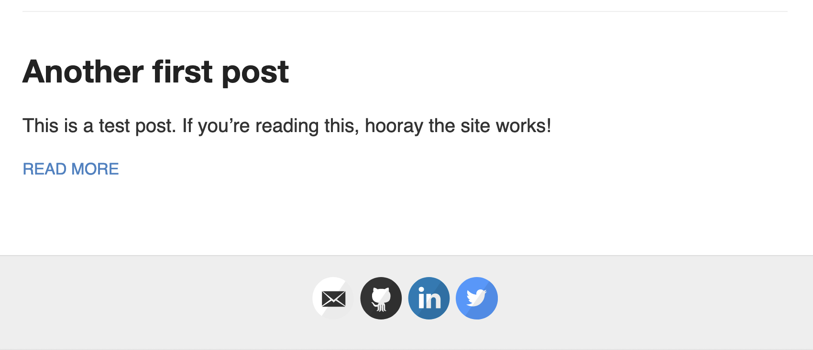

WARNING: This post is written years after the fact. I tried to verify everything using the git histories linked at the end.

== High School Fucking around

In my senior year of high school, my friends and I wrote a website that enabled students to sign up for the afterschool bus (used by students who had clubs). Initial prototyping was done under my github pages site (I probably didn't know about repo specific sites and used the one for my account). We moved the site its own repo under a separate github organization.

== Timeline

This site initially began approximately the summer between college and high school, so summer 2020. I saw the fancy websites of other software engineers, and wanted my own. All the tutorials recommended github pages (which used the jekyll website generator). I spent time configuring the theme and publishing my site, ... and proceeded to add no content. My first post (which has been removed), was merely a hello world. My second post, was about transferring control to the new officers of my high school's coding club.

Throughout my first semester of college (fall 2020), I added posts for the "scholars" program I was a part of (the program no longer exists following the director's departure). There was _at least two_ post about the instructions for a project I did that semester. The projects directions were poorly written, and I rewrote them to be clearer and terser.

Somewhere during this time I heard of the hugo site generator. It was "fast" and "written in go". I was sold (I held (and still hold to a lesser degree) the belief that everything newer is better and worth switching to). I set about porting my site, using that hello world post as a test. I didn't use any advanced jekyll features, so it was as simple as copying my markdown source files, picking a new theme, and fiddling with configuration. I also chose to publish my site to _gitlab pages_ instead. I believe this shift (hugo, gitlab) occurred during winter break (approx Jan 2021).

https://github.com/hybras/hybras.github.io/commit/56135a85c2efa675f65ad4d2d1645d6c12e053f0[I became fed up with markdown] and https://matthewsetter.com/technical-documentation/asciidoc/convert-markdown-to-asciidoc-with-kramdoc/[switched my site to asciidoc] https://github.com/hybras/hybras.github.io/commit/3eaa2637dd2422711ff063bed589c05ccc015f00[during summer 2021]. Ironically, the post about my markdown pet peeves was lost during the switch. I do not recall if this was intentional. Nevertheless I have revived the post.

While at university, my blog become moderately productive as I added technical content, scholars posts, and diary entries. On Feb 18th, I decided to make back to github pages. Gitlab's ui is slightly more annoying, and they ask you to login even to just browse. Also, yes, peer pressure because everything has been on github for years now. Most gitlab repo's I see these days are self-hosted instances. I couldn't figure out how to resign my commits, but I was able to change the commit author to my github account.

== Status Quo

So at this point, we have several git histories. I would like to preserve the git history of original jekyll site. But now that I've force pushed I don't think I can save it.

* https://github.com/hybras/hybras.github.io/commit/c489ca021c7fd373b7b252caa8aaf76e06cc57e1[My original jekyll site on github]
** Since I force pushed, this has been overwritten and will be lost when github runs `git gc`.
* https://gitlab.com/hybras/hybras.gitlab.io[My hugo site on gitlab pages]
** https://gitlab.com/hybras/hugo-asciinema/[A hugo theme for the sole purpose of using asciinema]
* My hugo site on github
** https://github.com/hybras/hybras.github.io/commit/d53c5fa84600d7e59e1bd869ced860c01c2b0a42[A "ghost" history of the above, from before I managed to preserve the commit dates from the gitlab repo]. This will also be deleted someday.

== Retrospective

This blog (and its technology stack) originated during a time when I was more susceptible to hopping on the NewThingTM. While this is annoying, it also meant I was willing to sink massive amounts of time towards learning and experimenting. I hope that as my attitude towards technology matures, I can keep bringing this blog into the future.

My mental health issues have not been resolved, making it harder to find motivation to blog (and topics to blog about) and to complete schoolwork. I hope these issues can be resolved quickly, lest I lose my passion altogether.

== Images of the Original Site

== Backup of the Original Site

link:./jekyll%20site%20backup.html[Backup]