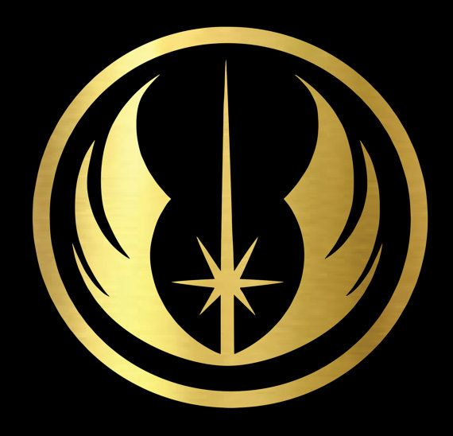

<link rel="shortcut icon" href="profile.jpg" type="image/gif">

# Hybras, AKA Varun Chari

Hello, my name is Varun Chari. I'm a senior in Central Jersey. My interests range from math and science to playing the flute and reading fantasy novels.

## Where's the handle come from?

To be honest, I've been struggling to keep to a single username for a long time. Right now, most of my accounts go by @hybras, though my user account on my computer is called arity. The word hybras doesn't seem to have any meaning. In the Artemis Fowl series, 'Hybras' is the island of demons, cast out of time in order to segregate the violent being from humanity.

## GPG/PGP Keys

You can find my keys at [keys.openpgp.org](https://keys.openpgp.org), under my [personal email](mailto:varunchari@yahoo.com) and [github email](mailto:24651269+hybras@users.noreply.github.com). My github key is used only to sign commits and expires yearly.
